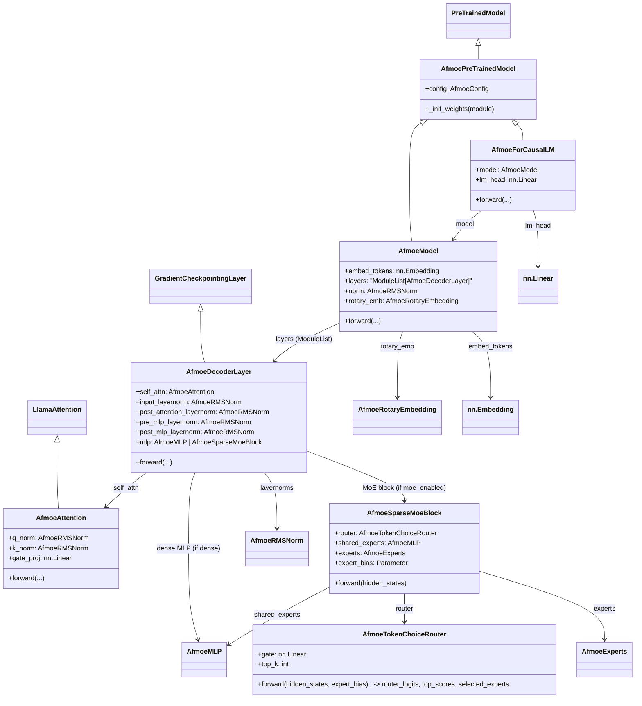

# Afmoe_Tensorflow

A Mixture-of-Experts (MoE) model is an AI architecture that splits a large neural network into smaller specialized sub-networks called experts, activating only the most relevant ones for each piece of data.

    
