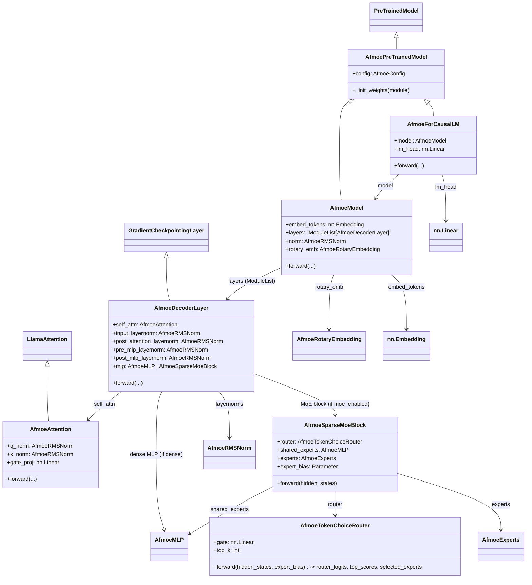

# Afmoe

AFMOE (Adaptive Feature Mixture-of-Experts) is a neural network architecture designed to improve model performance by dynamically selecting and combining specialized expert networks for different input features or patterns.

Instead of sending every input through the same computational pathway, AFMOE uses a gating mechanism to determine which experts are most relevant to a particular input. The selected experts process the input, and their outputs are adaptively weighted and combined to produce the final prediction.

A typical AFMOE pipeline can be represented as:

*Input → Feature Extraction → Adaptive Gating → Expert Networks → Weighted Feature Fusion → Output*

The main idea is to allow different experts to specialize in different characteristics of the data while the gating network learns when and how much each expert should contribute. This can provide greater flexibility than a conventional single-network architecture and can be useful for complex tasks involving diverse or heterogeneous patterns.

**Key characteristics**:

**Adaptive routing**: dynamically chooses relevant experts.
Expert specialization: different experts can learn different feature representations.

**Feature fusion**: combines expert outputs using learned weights.

**Scalability**: additional experts can be introduced for more specialized representations.

**Potential efficiency**: only a subset of experts may need to be activated for each input.

AFMOE can be adapted to applications such as computer vision, natural-language processing, time-series analysis, multimodal learning, and other machine-learning problems where different inputs may benefit from different learned representations.
